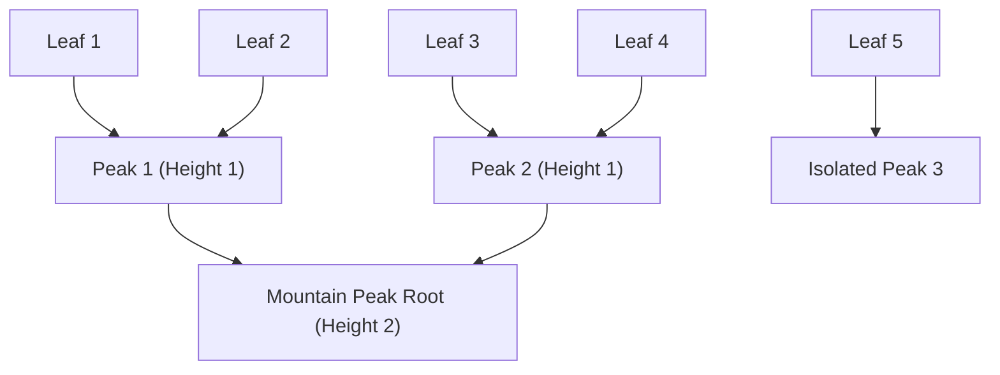

# Merkle Mountain Range (MMR) Accumulator Skill

Robust, zero-dependency Python implementation of **Merkle Mountain Ranges (MMR)** for append-only verifiable ledgers and light-client consensus.

## Features
- **Append-Only History**: Adds new transaction leaves in \(O(1)\) amortized hashing time.
- **Logarithmic Inclusion Proofs**: Verifies leaf membership via peak bag roots in \(O(\log N)\) proof bytes.
- **Zero External Dependencies**: Pure Python standard library (`hashlib`).
- **Native MCP Protocol**: JSON-RPC 2.0 stdio server compatible with Claude Desktop, Cursor, and Windsurf.

## Architecture

